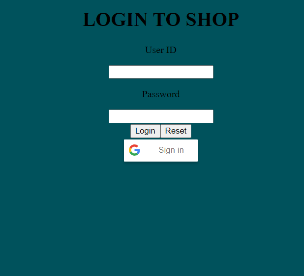
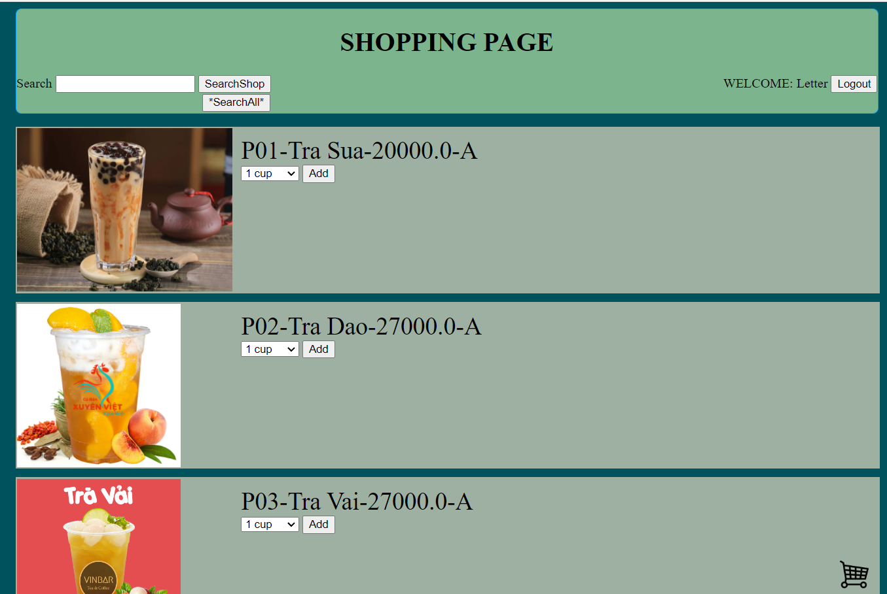
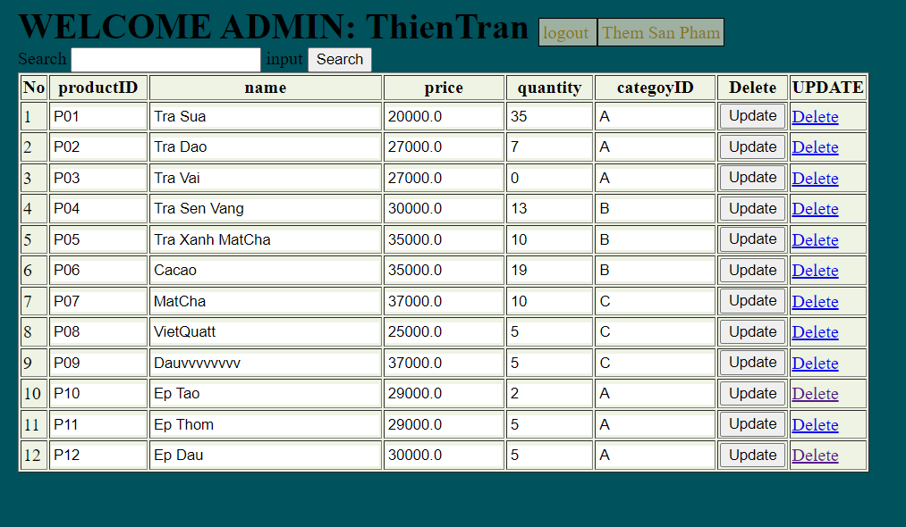
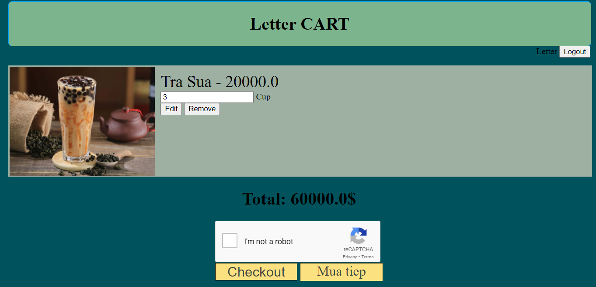

# TEA SALING WEB
PRJ301 - HoaDnt

:wave: My Project at FPT UNI course PRJ :wave:

## Table of Contents
- [Description](#description)
- [Preview Screenshot](#preview-screenshot)
- [Technology](#technology)
- [Functional requirements](#functional-requirements)
- [Useful Resources](#useful-resources)
- [Contributors](#contributors)
- [Reference](#reference)
- [License & Copyright](#license--copyright)

## Description
- This is a mini project selling Milk tea
- This web works well on desktop, not for mobile
- Use Netbean to combine and run
- run 'DataBaseDenkShop.sql' for database
- Change DBUtils for correct DB connection

## Preview Screenshot

  
  </img> &nbsp;&nbsp; 
  </img> &nbsp;&nbsp; 
  </img> &nbsp;&nbsp;
  </img> &nbsp;&nbsp;
  

  
## Technology
**1. Frontend**
  - HTML, CSS

**2. Backend**
  - Java Language

**3. Database**
  - Microsoft SQL Server - a relational model database server produced by Microsoft

**4. Other Technologies**
- MVC2 Model

**5. Tool**
  - Netbeans 8.2
  - Java JDK 8
  - Apache Tomcat 8.5.29
  - Visual Studio Code
  - Microsoft SQL Server Management Studio 18

## Functional requirements
**1. Guest:**
- [ ] Login by Gmail
- [x] Login

**2. User**
- [x] Search teas
- [x] CRUD cart
- [x] Checkout
- [x] Recapcha before checkout
- [x] Logout

**3. Admin:**
- [x] Search teas
- [x] CRUD teas
- [x] Logout

## Useful Resources

#| Name | Description
-| ---- | -----------
1| [Main Project Folder](https://github.com/Denkhotieu/Tea-Sale-Web/tree/main/DenkShop1) | -
2| [Database file](https://github.com/Denkhotieu/Tea-Sale-Web/blob/main/DataBaseDenkShop.sql) | -

## Contributors
- [Tran Minh Thien](https://github.com/Denkhotieu) - SE160413 

## Reference

- [Integrating Google Sign-In into your web app](https://developers.google.com/identity/sign-in/web/sign-in)

## License & Copyright
&copy; 2021 TranMinhThien.
